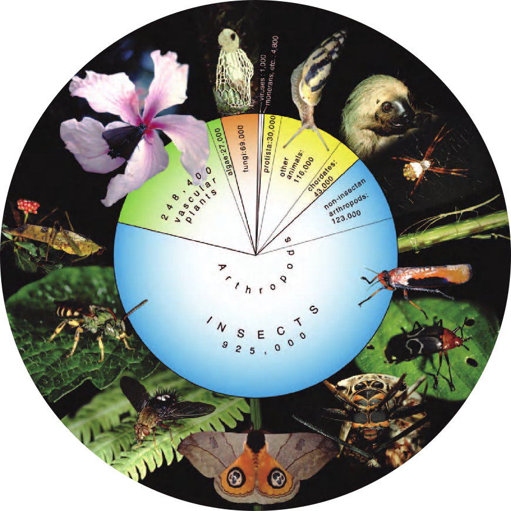
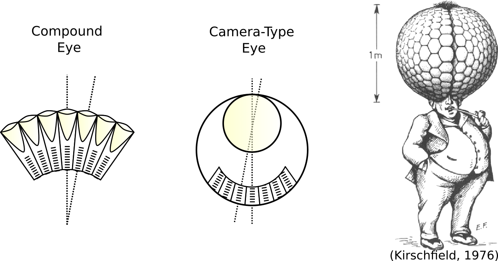
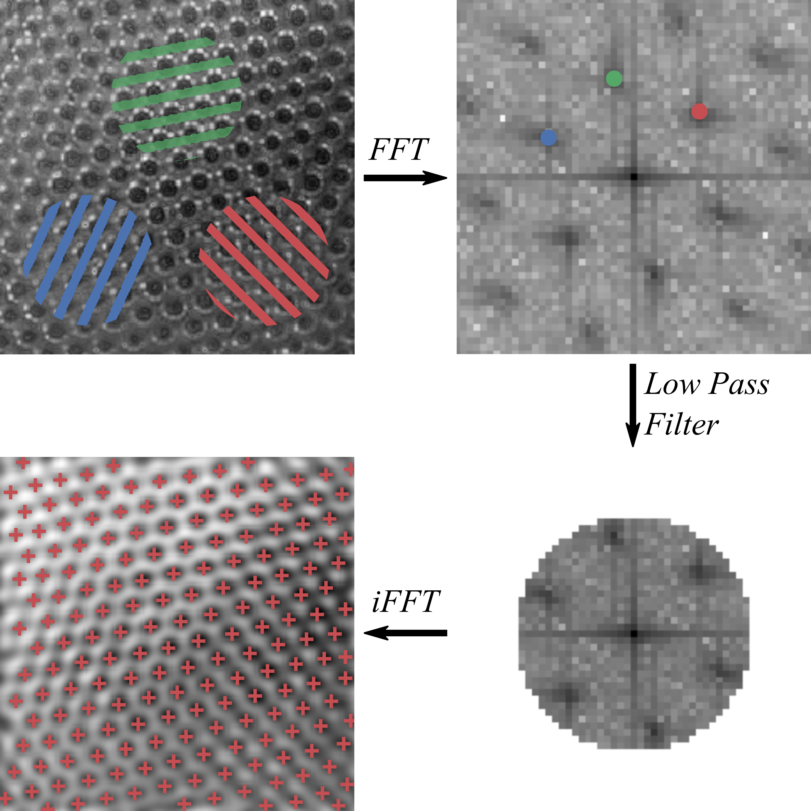
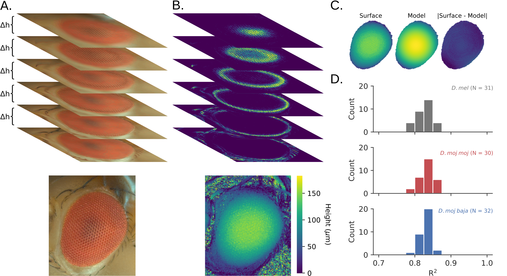
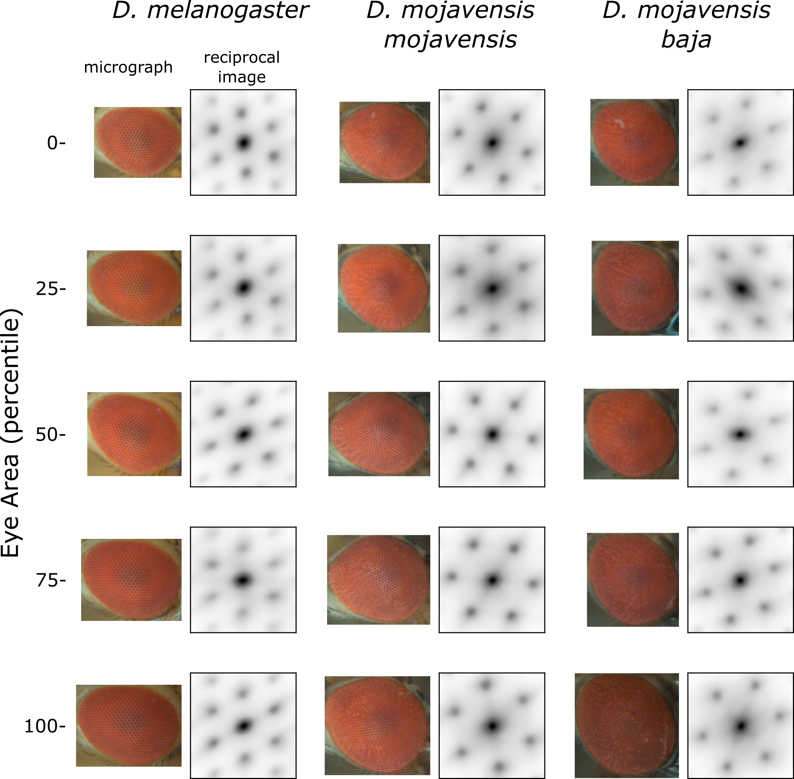
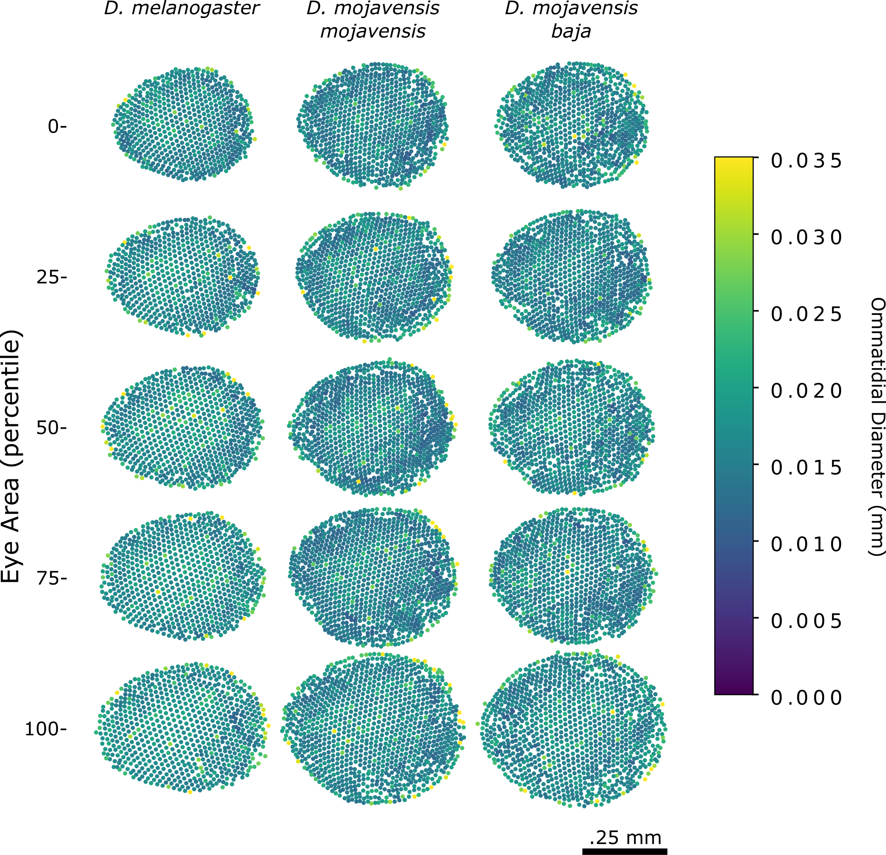
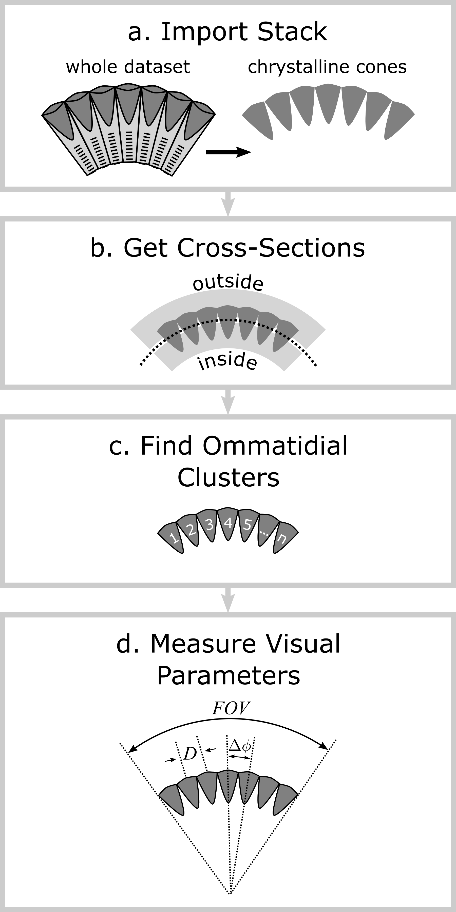
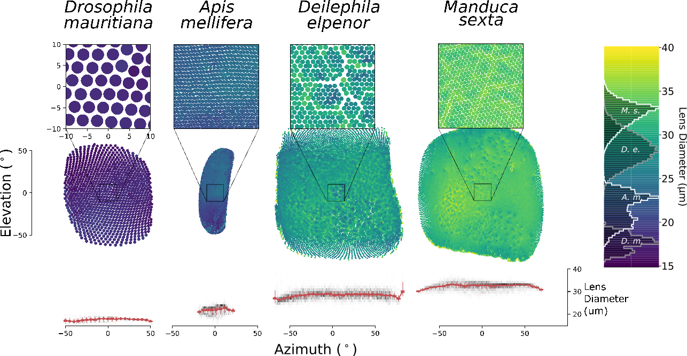
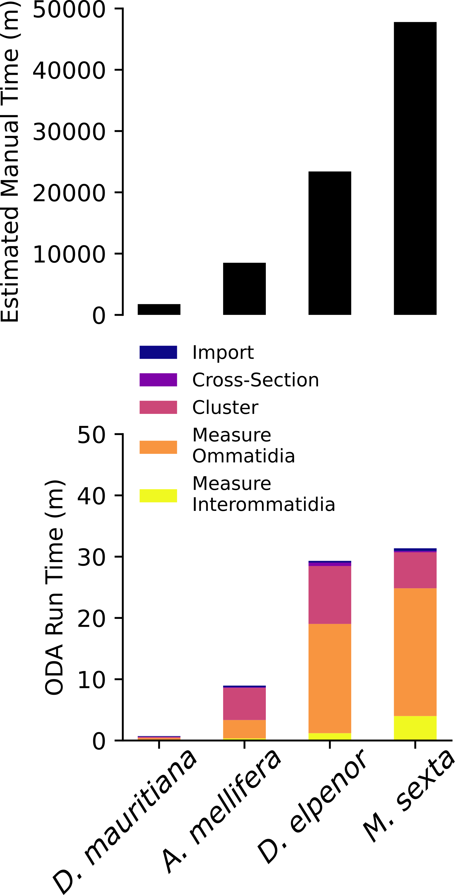

This Python library automatically counts and measures the ommatidia of compound eyes from images. The program is presented in [preprint](https://doi.org/10.1101/2020.12.11.422154), which has been accepted for publication in Communications: Biology and should be published soon.

## Contents
1. [On Counting Ommatidia](#intro)
2. [Ommatidia Detecting Algorithm (ODA)](#ODA)
3. [Installation](#install)
4. [Documentation](#documentation)
   a. [Eye: Individual Image of an Eye](#documentation_1)
   b. [EyeStack: Focus Stack of an Eye](#documentation_2)
   c. [CTStack: MicroCT of an Eye](#documentation_3)
<div id="intro"/>
## On Counting Ommatidia 

My graduate mentor once challenged me to count the ommatidia of vinegar flies (a.k.a. fruit flies, _Drosophila melanogaster_). I quickly learned that they have two compound eyes, each composed of about 1000 light collecting facets called ommatidia. I learned this as I counted the ommatidia of over 100 flies, culminating in over _90,000_ ommatidia (and [a publication](https://www.sciencedirect.com/science/article/pii/S0042698918300919))!

||
|:--:|
|*The geometric arrangement sped up the counting .. a little.*|

Many have braved this challenge of counting ommatidia because, among other reasons, compound eyes are the most common image forming structures on Earth. Compound eyes are used by arthropods, which occupy nearly every ecological niche and represent roughly 80% of described animal species (the massive blue slice of the pie of life below). Compound eyes vary substantially in shape and size, having adapted to the gamut of selective pressures. So, to understand how vision works, develops, and evolves, we must study compound eyes. 

||
|:--:|
|*The Pie of Life: notice the large blue slice representing arthropods*|

Plus, as opposed to our camera-type eyes, many of the structures limiting the visual performance of compound eyes can be measured in direct external images. The number and size of ommatidia set physical limitations on what a compound eye can see. Each one collects a pixel of the image captured by the retina and sits immediately adjacent to the next ommatidium, separated by screening pigment (see below). The angle separating neighboring ommatidia, called the interommatidial angle, determines the smallest resolvable detail just like the inter-receptor angle of our own camera-type eyes. The size of the ommatidial aperture limits the amount of light available for absorption so that large ommatidia offer greater sensitivity to low light levels. For a compound eye to acheive the same resolution as our eyes, for instance, it would need to be at least 1 meter in diameter and composed of millions of ommatidia! Counting and measuring ommatidia tells us a great deal about the spatial resolution and light sensitivity of many arthropods. 

||
|:--:|
|*Camera-type eyes can have higher acuity because one lens serves the whole retina.*|

Wouldn't it be nice if a program could count these ommatidia automatically? People have developed programs that beat grand champions in chess or generate fake videos of past presidents. If computers can drive cars and recognize faces, shouldn't they be able to detect ommatidia? Introducing the ..

<div id="ODA"/>
## Ommatidia Detecting Algorithm (ODA) 

After many hours of strained eyes and greuling ommatidia counting, I developed a pretty simple algorithm to get my computer to count ommatidia for me. Fortunately, it has generated counts and measurements that align well with manual measurements and measurements in the literature. That is detailed here in our preprint: https://doi.org/10.1101/2020.12.11.422154.

||
|:--:|
|*General Pipeline of the ODA*|

To get a feel for how the ODA works, check out [this python notebook](docs/oda_how_it_works.ipynb) or run it interactively on [Binder]()

<div id='install'/>
## Installation
This program uses Python 3.6+ and has a number of dependencies. For a simple, bare bones installation of the ODA package, simply run the following from the command line: <br>```pip install git+https://github.com/jpcurrea/ODA.git```

That will install the dependencies and module but if you want to test the code before running we recommend the following procedure, which is only slightly longer:

1. Open a terminal and change into the desired folder. Use git to clone the github repository: <br>```git clone https://github.com/jpcurrea/ODA.git```
2. Use pip to install the module and dependencies: <br>```cd ODA```<br>```pip install .```
This should download additional files including 3 test datasets for testing.
3. Run the test scripts to see if everythin installed correctly:<br>```cd tests```<br>```python test_all.py```

If the test script runs, it'll run 3 tests attempting to detect ommatidia in 1) an individual image of an eye, 2) a depth or focus stack of images of one eye, and 3) a CT stack of one eye. If they work, each will display the results and should have around 900 ommatidia. If you run into trouble with this or generate different results, feel free to contact Pablo.

<div id='documentation'/>
## Documentation
We tried to provide useful docstrings for each class in the [code itself](https://github.com/jpcurrea/ODA/blob/main/src/ODA/analysis_tools.py). The ODA module was designed to process many different media. The initial use case was individual microscope images of insect eyes, like those at the top of the page. In the process of developing this method, we discovered the utility of keeping track of the individual layers of a focus stack in order to reconstruct the 3D surface of the eye. Moreover, we found that the same algorithm can be used in a more elaborate pipeline for processing 3D microCT stacks of insect eyes. We developed a distinct object for handling each of these 3 media types.

<div id='documentation_1'/>
### 1. Image of an Eye

```python
class Eye(Layer):

    def __init__(self, filename=None, arr=None, bw=False, pixel_size=1, 
                 mask_fn=None, mask_arr=None):
        """A class specifically for processing images of compound eyes. 
        

        Parameters
        ----------
        filename : str
            The file path to the eye image.
        bw : bool
            Whether the image in greyscale.
        pixel_size : float, default = 1
            The actual length of the side of one pixel.
        mask_fn : str, default = "mask.jpg"
            The path to the sillhouetting mask image file.
        mask : array_like, default = None
            Boolean masking image with the same shape as the input image array.
        
        Methods
        -------
        get_eye_outline
            Get the outline of the eye based on an eye mask.
        get_eye_dimensions
            Assuming an elliptical eye, get its length, width, and area.
        crop_eye
            Crop the image so that the frame is filled by the eye with padding.
        get_ommatidia
            Detect ommatidia coordinates assuming hex or square lattice.
        measure_ommatidia
            Measure ommatidial diameter using the ommatidia coordinates.
        ommatidia_detecting_algorithm or oda
            The complete algorithm for measuring ommatidia in images.
        """
        [...]
```


|Example Results|
|:--:|
||
|*This comparison of the ODA on 5 different ant eye replicas was included in the [methods paper](https://doi.org/10.1101/2020.12.11.422154). The automated counts were 99% and the diameters were 93% of those measured by hand*|

The [Eye object](https://github.com/jpcurrea/ODA/blob/55684a97fb32a95f24d17eaf04c49253c98fee27/src/ODA/analysis_tools.py#L1268) takes in an eye image and an optional masking image to indicate which pixels correspond to the eye. You can also input the length of each pixel so that the program can provide actual measurements of length. Once instantiated, an Eye can run a number of methods on the image including cropping the eye, getting it's dimensions, finding ommatidia, and taking measurements of the eye. To run all of this in the appropriate order, run the Eye.ommatidia_detecting_algorithm method. Here's an example script for loading an individual Eye image. The following assumes that you cloned the tests folder from our github repository.

#### Processing a single Eye

```python
# import the module and dependencies
from ODA import *                           
import os

# set the pixel size based on known measurements
PIXEL_SIZE = (488.84896*2)**-1  # mm 

# load the image and initialize the Eye object
eye = Eye("tests/002.jpg", mask_fn="tests/002/mask.jpg", pixel_size=PIXEL_SIZE)

# run the ommatidia_detecting_algorithm using the following settings:
eye.oda(bright_peak=False, high_pass=True, plot=True,
        plot_fn='tests/002_ommatidia.svg', manual_edit=True)
``` 

The script above uses the ODA to process the image tests/002.jpg using the mask image tests/002/mask.jpg and saving the image with the location of the ommatidia superimposed at the file "tests/002_ommatidia.svg". The main function here is the ommatidia_detecting_algorithm or oda method of the Eye object. Here's the docstring for that method:
```python
    def ommatidia_detecting_algorithm(self, bright_peak=True, fft_smoothing=5,
                                      square_lattice=False, high_pass=False,
                                      num_neighbors=3, sample_size=100, plot=False,
                                      plot_fn=None, regular=True, manual_edit=False):
        """The complete algorithm for measuring ommatidia in images.

        
        Parameters
        ----------
        bright_peak : bool, default=True
            Whether the ommatidia are defined by brighter (vs. darker) peaks.
        fft_smoothing : int, default=5
            The standard deviation of a 2D gaussian filter applied to the 
            reciprocal image before finding peaks.
        square_lattice : bool, default=False
            Whether this a square (rather than a hexagonal) lattice.
        high_pass : bool, default=False
            Whether to also filter frequencies below the fundamental one.
        num_neighbors : int, default=6
            The number of neighbors to check for measuring the ommatidial 
            diameter. Defaults to 6, assuming a hexagonal lattice.
        sample_size : int, default=100
            The number of ommatidia near the center to include in diameter
            estimation.
        plot : bool, default=False
            Whether to plot the eye with ommatidia and diameters superimposed.
        plot_fn : str, default=None
            Filename to save the plotted eye with superimposed ommatidia and 
            their diameters.
        regular : bool, default=False
            Whether to assume the ommatidial lattice is approximately regular.
        manual_edit : bool
            Whether to allow the user to manually edit the ommatidia coordinates.

        Attributes
        ----------
        eye_length : float
            Major diameter of the fitted ellipse.
        eye_width : float
            Minor diameter of the fitted ellipse.
        eye_area : float
            Area of the fitted ellipse
        ommatidia : np.ndarray
            2D coordinates of N ommatidia with shape N x 2.
        ommatidial_diameter_fft : float
            The average wavelength of the fundamental frequencies, 
            corresponding to the ommatidial diameters.
        ommatidial_diameter : float
            Average ommatidial diameter of sample near the mask center of mass.
        ommatidial_diameter_SD : float
            Standard deviation of ommatidial diameters in sample.
        """
    [...]
```
#### Processing a batch of Eyes
Here's an example of how to run the ODA on a folder of images, collecting important measurements into a spreadsheet, eye_data.csv:

```python
"""Batch process all images of compound eyes and save the results.


Assumes the following folder structure:

.\
|--batch_process_images.py
|--pixel_size.csv (optional)    # stored pixel-to-distance conv.
|--image_001.jpg
|--image_002.jpg
|...
|--masks\
   |--image_001.jpg             # white sillouetting mask on black background
   |--image_002.jpg
   |...
|--image_001_ommatidia.jpg (outcome)
|--image_002_ommatidia.jpg (outcome)
|...
|--eye_data.csv
|--_hidden_file
"""
import os
from scipy import misc
from analysis_tools import *
import pandas as pd


# Custom parameters
# if a list, must be one-to-one with images
BRIGHT_PEAK = False             # True assumes a bright point for every peak
HIGH_PASS = True               # True adds a high-pass filter to the low-pass used in the ODA
SQUARE_LATTICE = True          # True assumes only two fundamental gratings
FILE_EXTENSION = ".jpg"        # assumes you're only interested in this file extension


# make dictionary to store relevant information
values = {
    "filename":[], "eye_area":[], "eye_length":[], "eye_width":[],
    "ommatidia_count":[], "ommatidial_diameter":[], "ommatidial_diameter_std":[],
    "ommatidial_diameter_fft":[]
}

# load filenames and folders
fns = os.listdir(os.getcwd())
img_fns = [fn for fn in fns if fn.endswith(".jpg")]
img_fns = [fn for fn in img_fns if "ommatidia" not in fn] # omit outcome images
folders = [fn for fn in fns if os.path.isdir(fn)]
folders = [os.path.join(os.getcwd(), f) for f in folders]
# load the mask filenames
mask_fns = os.listdir("./masks")
mask_fns = [os.path.join(os.getcwd(), f) for f in mask_fns]
# load pixel sizes from a local file, if present
pixel_sizes = []
if os.path.exists("pixel_size.csv"):
    pixel_sizes_csv = pd.read_csv("pixel_size.csv")
    for img_fn in img_fns:
        breakpoint()
else:
    PIXEL_SIZE=1
# for each image
for img_fn, mask_fn in zip(img_fns, mask_fns):
    # skip hidden files
    if not img_fn.startswith("_"):
        print(img_fn)
        # get new filename from the image filename
        fn_base = img_fn.split(".")[0]
        result_fn = f"{fn_base}_ommatidia.jpg"
        # generate the Eye object using the image
        eye = Eye(img_fn, bw=True, mask_fn=mask_fn)
        eye.oda(bright_peak=BRIGHT_PEAK, high_pass=HIGH_PASS,
                square_lattice=SQUARE_LATTICE, plot_fn=result_fn)
        # store relevant parameters
        for key in values.keys():
            values[key] += [getattr(st, key)]
        print()

dataframe = pd.DataFrame(values)
dataframe.to_csv("eye_data.csv", index=False)
```

<div id='documentation_2'/>
### 2. Focus Stack of an Eye

The [EyeStack object](https://github.com/jpcurrea/ODA/blob/55684a97fb32a95f24d17eaf04c49253c98fee27/src/ODA/analysis_tools.py#L1914) takes a folder of images representing the layers of a focus stack of an eye and an optional masking image. Once instantiated, an EyeStack can run a number of methods like the Eye object described above with additional 3D measurements allowing the approximation of interommatidial angle, field of view, and radius of curvature. 

```python
class EyeStack(Stack):

    def __init__(self, dirname, img_extension='.jpg', bw=False, pixel_size=1, depth_size=1, mask_fn='mask.jpg', mask_arr=None):
        """A special stack for handling a focus stack of fly eye images.

        Parameters
        ----------
        img_extension : str, default=".jpg"
            The image file extension used to avoid unwanted images.
        bw : bool, default=False
            Whether to treat the image as grayscale.
        pixel_size : float, default=1
            The real length of the side of one pixel in the image. Used for
            converting from pixel into real distances.
        depth_size : float, default=1
            The real distance between stack layers. 
        mask_fn : str, default="mask.jpg"
            The filename of the boolean masking image.
        mask_arr : array-like, default=None
            2D boolean masking array.
        
        Attributes
        ----------
        eye : Eye
            The Eye object of the focus stack of cropped image layers.
        pixel_size : float, default=1
            The real length of the side of one pixel.
        depth_size : float, default=1
            The real distance between stack layers.
        eye_mask : array-like, default="mask.jpg"
            2D boolean masking array.
        ommatidia_polar : np.ndarray, default=None
            The ommatidia locations in spherical coordinates relative to 
            the best fitting sphere.
        fns : list
            The list of included filenames.
        """
        [...]
```
The 3D reconstruction works by comparing the level of focus of each pixel to that of the corresponding pixel in the other layers. Below is a figure from [another one of my projects](https://doi.org/10.1016/j.isci.2021.103637) that applied this method to compare the visual properties of vinegar flies (*D. melanogaster*) to two subspecies of a fly native to deserts in southwest North America (*D. mojavensis mojavensis* and *D. mojavensis baja*): 

||
|:--:|
|*A) Using a microscope, multiple images were taken at fixed intervals of height (Δh). By taking each pixel of greatest focus we construct a focus stack from the stack of color images. B) By comparing the amount of spatial detail for each image and finding the height that maximizes it for each pixel, we approximated the 3D eye surface. C) The 3D eye surface (left) is modeled as a sphere (middle) resulting in small errors (right). The sphere provided us with an approximate radius of curvature for calculating interommatidial angles and FOV. D) The spherical model was a good fit (R2≅ .8) for all three genotypes.*|

#### Processing a single EyeStack
To run all of this in the appropriate order, run the Eye.oda_3d method. Here's an example script for loading an individual EyeStack.
```python
# import the module and dependencies
from ODA import *                           
import os

# set the pixel size based on known measurements
# Custom parameters
PIXEL_SIZE = (488.84896*2)**-1  # measured manually
DEPTH_SIZE = .004*3            # from the mircroscope manual
BRIGH_PEAK = False             # True assumes a bright point for every peak
HIGH_PASS = True               # True adds a high-pass filter to the low-pass used in the ODA
SQUARE_LATTICE = True          # True assumes only two fundamental gratings
OUTPUT_FN = "tests/stack_demo.svg"

# load the image and initialize the Eye object
folder = "tests/002"
st = EyeStack(folder, f_type=".TIF", mask_fn=os.path.join(folder, "mask.png"),
              pixel_size=PIXEL_SIZE, depth_size=DEPTH_SIZE)
st.oda_3d(high_pass=HIGH_PASS, plot_fn=OUTPUT_FN,
          bright_peak=BRIGH_PEAK, square_lattice=SQUARE_LATTICE)
``` 

The script above uses a 3D version of the ODA to process the eye stack in tests/002/ using the mask file tests/002/mask.jpg and saving the eye image with the location of the ommatidia superimposed at the file "tests/stack_demo.svg". Here's the docstring for that method:

```python
    def oda_3d(self, eye_stack_smoothing=0, bright_peak=True, fft_smoothing=5,
               square_lattice=False, high_pass=False, num_neighbors=3, sample_size=100,
               plot=False, plot_fn=None, use_memmaps=False, manual_edit=False):
        """Detect ommatidia using the 3D surface data.

        Parameters
        ----------
        eye_stack_smoothing : float, default=0
            Std deviation of gaussian kernal used to smooth the eye surface.
        bright_peak : bool, default=True
            Whether the ommatidia are defined by brighter (vs. darker) peaks.
        fft_smoothing : int, default=5
            The standard deviation of a 2D gaussian filter applied to the 
            reciprocal image before finding peaks.
        square_lattice : bool, default=False
            Whether this a square---rather than a hexagonal---lattice.
        high_pass : bool, default=False
            Whether to also filter frequencies below the fundamental one.
        num_neighbors : int, default=6
            The number of neighbors to check for measuring the ommatidial 
            diameter. Defaults to 6, assuming a hexagonal lattice.
        sample_size : int, default=100
            The number of ommatidia near the center to include in diameter
            estimation.
        plot : bool, default=False
            Whether to plot the eye with ommatidia and diameters superimposed.
        plot_fn : str, default=None
            Filename to save the plotted eye with superimposed ommatidia and 
            their diameters.
        use_memmaps : bool, default=False
            Whether to use memory maps instead of loading the images to RAM.
        manual_edit : bool, default=False
            Whether to use a GUI to edit the results of the ODA.

        Attributes
        ----------
        sphere : SphereFit
            An OLS-fitted sphere to the 3D ommatidia coordinates. 
            Transforms the points into polar coordinates relative to 
            the fitted sphere.
        fov_hull : float
            The field of view of the convex hull of the ommatidia in
            polar coordinates.
        fov_long : float
            The longest angle of view using the long diameter of the
            ellipse fitted to ommatidia in polar coordinates.
        fov_short : float, steradians
            The shortest angle of view using the short diameter of 
            the ellipse fitted to ommatidia in polar coordinates.
        surface_area : float, steradians
            The surface area of the sphere region given fov_hull and
            sphere.radius.
        io_angles : np.ndarray, rads
            The approximate inter-ommatidial angles per ommatidium 
            using eye.ommatidial_diameters and eye radius in rads.
        io_angle : float, rad
            The average approximate inter-ommatidial angle using 
            eye.ommatidial_diameter / self.sphere.radius
        io_angle_fft : float, rad
            The average approximate inter-ommatidial angle using
            eye.ommatidial_diameter_fft / self.sphere.radius
        """
        [...]
```
#### Processing a batch of EyeStacks
Here's an example of how to run the ODA on a folder of subfolders containing focus stacks of insect eyes, collecting important measurements into a spreadsheet, eye_stack_data.csv:

```python
"""Batch process all folders of eye stacks and save.


Assumes the following folders of stacks of .jpg images and binary mask images:

.\
|--batch_process_eye_stacks.py
|--stack_1\
   |--img_001.jpg
   |--img_002.jpg
   |...
   |--mask.png
|--stack_1_ommatidia.jpg (outcome)
|--stack_2\
   |--img_001.jpg
   |--img_002.jpg
   |...
   |--mask.png
|--stack_2_ommatidia.jpg (outcome)
|--eye_stack_data.csv
|--_hidden_folder\
   |(skipped files)
   |...
"""
import os
from scipy import misc
from analysis_tools import *
import pandas as pd


# Custom parameters
PIXEL_SIZE = (488.84896*2)**-1  # measured manually
DEPTH_SIZE = .004*3            # from the mircroscope manual
BRIGH_PEAK = False             # True assumes a bright point for every peak
HIGH_PASS = True               # True adds a high-pass filter to the low-pass used in the ODA
SQUARE_LATTICE = True          # True assumes only two fundamental gratings

# make dictionary to store relevant information
values = {
    "dirname":[], "surface_area":[], "eye_length":[], "eye_width":[],
    "radius":[], "fov_hull":[], "fov_long":[], "fov_short":[], 
    "ommatidia_count":[], "ommatidial_diameter":[], "ommatidial_diameter_std":[],
    "ommatidial_diameter_fft":[], "io_angle":[], "io_angle_std":[],
    "io_angle_fft":[]
}
params = ["dirname", "surface_area", "eye_length"]

# load filenames and folders
fns = os.listdir(os.getcwd())
img_fns = [fn for fn in fns if fn.endswith(".jpg")]
folders = [fn for fn in fns if os.path.isdir(fn)]
folders = [os.path.join(os.getcwd(), f) for f in folders]
# for each folder
for folder in folders:
    # skip hidden folders
    base = os.path.basename(folder)
    if not base.startswith("_"):
        print(folder)
        # get stack name from the folder name
        path, base = os.path.split(folder)
        stack_name = f"{base}_ommatidia.jpg"
        ommatidia_fig_fn = os.path.join(path, stack_name)
        # get the eye stack and save the image with the ommatidia superimposed
        st = EyeStack(folder, f_type=".TIF", mask_fn=os.path.join(folder, "mask.png"),
                      pixel_size=PIXEL_SIZE, depth_size=DEPTH_SIZE)
        st.oda_3d(high_pass=HIGH_PASS, plot_fn=ommatidia_fig_fn,
                  bright_peak=BRIGH_PEAK, square_lattice=SQUARE_LATTICE)
        # rename relevant parameters so they can be accessed using getattr
        st.radius = st.sphere.radius
        st.eye_width = st.eye.eye_width
        st.eye_length = st.eye.eye_length
        st.ommatidia_count = len(st.eye.ommatidia)
        st.ommatidial_diameter = st.eye.ommatidial_diameter
        st.ommatidial_diameter_std = st.eye.ommatidial_diameter.std()
        st.ommatidial_diameter_fft = st.eye.ommatidial_diameter_fft
        st.io_angle = st.io_angle * 180 / np.pi
        st.io_angle_std = st.io_angles.std() * 180 / np.pi
        st.io_angle_fft = st.io_angle_fft * 180 / np.pi
        fov_long, fov_short = max(st.fov_long, st.fov_short), min(st.fov_long, st.fov_short)
        st.fov_long = fov_long
        st.fov_short = fov_short
        # store relevant parameters
        for key in values.keys():
            values[key] += [getattr(st, key)]
        print()

dataframe = pd.DataFrame(values)
dataframe.to_csv("eye_stack_data.csv", index=False)
```
#### Example

|||
|:--:|:--:|
|*[Comparison of 2 fruit fly species](https://doi.org/10.1016/j.isci.2021.103637) using the reciprocal image.*|*The ODA 3D approximates the ommatidial diameters using 3D distances.*|

<div id='documentation_3'/>
### 3. CT Stack

The [CTStack](https://github.com/jpcurrea/ODA/blob/55684a97fb32a95f24d17eaf04c49253c98fee27/src/ODA/analysis_tools.py#L2138) takes a folder of images representing the layers of a micro CT stack of an eye. This is presumed to be filtered enough that an initial voxel value filter is sufficient to include only the voxels of interest. Once instantiated, a CTStack can run a number of methods to measure the ommatidial and interommatidial data characteristic of the eye's optical performance. 

Running the main method, ommatidial_detection_algorithm, produces an .h5 file with the intermittent data to produce two spreadsheets: ommatidial_data.csv and interommatidial_data.csv. These have ommatidia and interommatidial pairs as each row in the corresponding spreadsheet, containing relevant measurements of each such as their position, orientation, and size and variables pertinent to each dataset. It's designed to run and save in a modular fashion so that if the program crashes or is interrupted, the results can be loaded from the preceding module and run using new parameters. Here is the docstring of the CTStack object:

```python
class CTStack(Stack):

    def __init__(self, database_fn='_compound_eye_data.h5', **kwargs):
        """A special stack for handling a CT stack of a compound eye.

        Parameters
        ----------
        database_fn : str, default="_compoint_eye_data.h5"
            The filename of the H5 database with loaded values.
        dirname : str
            Path to the directory containing the images to load.
        img_extension : str
            The file extension of the images to load.
        bw : bool
            Whether the images are greyscale.
        pixel_size : float, default=1
            Actual length of the side of a pixel.
        depth_size : float, default=1
            Actual depth interval between individual layers.

        Attributes
        ----------
        layers : list
            The list of image layers.
        layer_class : Layer, Eye
            The class to use for each layer.
        img_extension : str
            The file extension to use for importing images.
        fns : list
            The list of filenames included in the Stack.

        Methods
        -------
        __del__
        load_database
            Initialize and load the H5 database.
        close_database
            Delete the H5PY database.
        save_database
            Save the H5PY database by closing and reopening it.
        prefilter
            Filter the layers and then save in a new folder.
        import_stack
            Filter the images including values between low and high.
        get_cross_sections
            Approximate surface splitting the inner and outer sections.
        find_ommatidial_clusters
            2D running window applying ODA to spherical projections.
        measure_ommatidia
            Take measurements of ommatidia using the ommatidial clusters.
        measure_interommatidia
            Use the anatomical axes to quickly measure interommatidial angles.
        plot_raw_data, plot_cross_section, plot_ommatidial_clusters, 
        plot_ommatidial_data, plot_ommatidial_data_3d, plot_interommatidial_data,
        plot_interommatidial_data_3d, plot_data_3d 
            Convenient functions for plotting the corresponding data.
        ommatidia_detecting_algorithm
            Apply the 3D ommatidia detecting algorithm (ODA-3D).
        stats_summary
            Calculate important statistics for whatever data is available.
        """
    [...]
```
#### ODA-3D

The ODA-3D works by converting the 3D dataset of an eye into 2D images by projecting the 3D eye surface onto 2D planes perpendicular to the surface and then applying the 2D ODA to segment the dataset into blobls correspoding to each ommatidium. There are special considerations for eyes with ommatidia askew to the eye surface. For details on the pipeline, see the [preprint](https://doi.org/10.1101/2020.12.11.422154).

|||
|:--:|:--:|

#### Time Saved

We profiled the performance of the ODA-3D on 4 different datasets in comparison to estimates of how long they would take to measure and count by hand. The results suggested that the ODA is very accurate and can perform ~1,000 times faster than manual measurements.
| Species Comparison | Benchmark |
|:--:|:--:|
|||

#### Processing a CTStack

```python
"""Test script for processing a CT stack.
"""
from ODA import *

# set important parameters
PIXEL_SIZE = .325
PIXEL_SIZE *= 4                 # the bin length
DEPTH_SIZE = PIXEL_SIZE
POLAR_CLUSTERING = True         # spherical eye
# load the CT stack in this same tests folder
ct_stack = CTStack(
    dirname="d_mauritiana_ct_stack", img_extension=".tif",  
    bw=True, pixel_size=PIXEL_SIZE, depth_size=DEPTH_SIZE)
ct_stack.ommatidia_detecting_algorithm(polar_clustering=True)
# plot the data using the 3D GUI
ct_stack.plot_data_3d()
```
